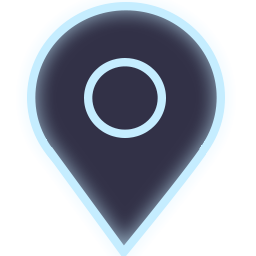
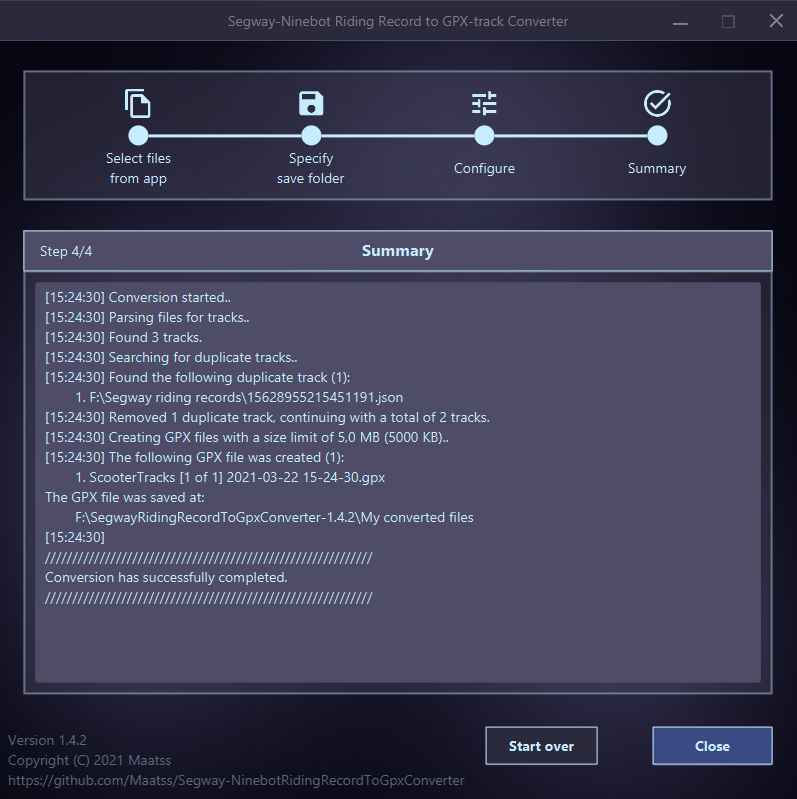

f

<h1>Segway-Ninebot Riding Record to GPX Converter</h1>
<h3>Helps you get all your tracks in one place.</h3>
<h1></h1>

# What is it?
A small portable (no install needed) application for converting `riding record` files created by the official [Segway-Ninebot android app](https://play.google.com/store/apps/details?id=com.ninebot.segway&hl=en_US&gl=US) to the versatile [.gpx](https://en.wikipedia.org/wiki/GPS_Exchange_Format) file format.

The application offers 3 main features:
- Combining multiple `riding record` files into a single `.gpx` file.
- Split up multiple `riding record` files into multiple `.gpx` files with a specified max file size.
- Detecting and skipping duplicate `riding record` tracks. 

# Why is it useful?
I personally created this software to ease the transition from the `Segway-Ninebot android app` to other gps tracking apps, for example this [open source variant](https://gitlab.com/rcgroot/open-gps-tracker). I found myself looking for an app alternative such that I could easily overview all the trips me and my significant other had gone on, without loosing all our previous `riding records`. I stumbled upon `Google MyMaps` which allowed me to do this exactly, it allows a user to upload gps tracking data as tracks or points of interest to be viewed in the native Google Maps ecosystem - e.g. [this map](https://www.google.com/maps/d/viewer?mid=1xiU6yTIgHJ0aC_MP_J7Ejzny4FWmfOwp&ll=-27.493212049108234%2C153.06052364236191&z=12).

To use the `riding records` created by `Segway-Ninebot android app` in other software it must be converted to another format, that can be understood by other programs. The `.gpx` file format is but one such format, but it is simple and common enough to be understood by a great number of programs.

# How do I use it?
To use this application you must first locate the `riding records` stored on your android device.
As the `Segway-Ninebot android app` currently has no way to export the `riding records` directly, we must take a detour and extract them ourselves.
The steps for doing this are explained below.

Steps overview:
1. Locate and extract `riding records`
2. Convert the `riding record .json` files to `.gpx` files
3. (Extra) Upload `.gpx` files to `Google MyMaps`

Requirements:
- Android device
- `Segway-Ninebot android app` installed and with your `riding records` available on said device.
- PC Windows 64-bit

## Step 1. Locate and extract riding records
1.1 Start the `Segway-Ninebot android app` and make sure all the `riding records` can be viewed with no internet connection.
**This ensures that the records are stored on the device.**

1.2 **Enable developer mode on your android device.**
As stated before, the `Segway-Ninebot android app` currently does not support exporting the `riding records` directly, so we will instead access the saved `riding record` files stored inside the app's internal storage directory.
This storage directory can be accessed by a computer if the android device has developer mode enabled.

There are many guides available on the web for how to enable developer mode for android devices, and as such I will point you to any of those - e.g. [this guide](https://www.greenbot.com/article/2457986/how-to-enable-developer-options-on-your-android-phone-or-tablet.html). 
The procedure roughly follows these steps: go to `device settings` -> `About phone` -> Tap x times on `Build number`.

1.3 **Enable USB-debugging on your android device**. Again, similarly to the previous step there are a ton of guides for enabling USB-debugging on android devices, e.g. [this guide](https://www.kingoapp.com/root-tutorials/how-to-enable-usb-debugging-mode-on-android.htm). The procedure is very simple as you only need to toggle a box under `Developer options`, a box appropriately named `USB debugging`.

1.4 Connect your android device to a computer via USB.

1.5 **Locate the `riding records` stored on your android device.** Explore the files on your android device using your favorite program, e.g. [Windows file explorer](https://en.wikipedia.org/wiki/File_Explorer). Navigate to `Phone` -> `Android` -> `data` -> `com.ninebot.segway` -> `files` -> `track`. The files could also be located on your external sd-card, e.g. `Card` -> `Android` -> `data` -> `com.ninebot.segway` -> `files` -> `track`.

1.6 **Copy all the `.json` files to a folder on your computer.** It does not matter where you put them, just remember where. The `riding record` files should look something like `16190854025847802.json`.

**Step 1 is done!** You can now disconnect your android device, disable USB-debugging and developer mode if you wish, and put it to the side, as it is not needed for any of the upcoming steps.

## Step 2. Convert the riding record `.json` files to `.gpx` files.
2.1 Download the [latest release](https://github.com/Maatss/SegwayTrackToGpxConverter/releases/latest) of this application.

2.2 Extract the contents of the downloaded zip file and simply run the `.exe` file, no installation required.

2.3 Follow the instructions in the application.

**Step 2 is done!** You have now converted your `riding records` from the `Segway-Ninebot android app` to the common and widely accepted `.gpx` format.

## (Extra) Step 3. Upload `.gpx` files to `Google MyMaps`
3.1 **Use a file limit of 5MB when converting your `riding record .json` files to `.gpx` files.**
`Google MyMaps` has a file size limit of 5MB, and as such we can utilize the file size limit feature of this application when converting our files.

3.2 Create and/or login to your google account, and navigate to [Google MyMaps](https://mymaps.google.com/).

3.3 Follow [these steps](https://support.google.com/mymaps/answer/3024454?hl=en&ref_topic=3024924) given by Google on how to create your own map.

3.4 **Follow [these steps](https://support.google.com/mymaps/answer/3024836?hl=en&ref_topic=3024924#zippy=) given by Google on how to upload files to your map, i.e. your `riding record .gpx` files.**
Do note that there is a limit at 10 layers, meaning that a user can only have 10 separate files uploaded at any time. If this becomes an issue due to a high amount of `riding records` (~40-100+), you can look into ways to reduce the size of each individual track, or converting your `.gpx` files into the more complex but more compact [`.kml`](https://en.wikipedia.org/wiki/Keyhole_Markup_Language) file format.

**Congratulations!** You have now successfully migrated your `riding records` from the `Segway-Ninebot android app` to `Google MyMaps`. I hope you found this application and guide helpful.

# Credits
- Thanks to [Open GPS Tracker](https://gitlab.com/rcgroot/open-gps-tracker) for the `.gpx` file creation procedure.
- Thanks to [Material Design](https://material.io/) for several of the icons used in the application.

# License
This project is licensed under the terms of  [GNU General Public License v3.0](https://choosealicense.com/licenses/gpl-3.0/).

# SEO
Segway-Ninebot, Segway-Ninebot app, Segway-Ninebot app riding records, combine riding records,  combining, riding record, track, tracking, GPS tracking, trip, Android, open source, convert, json to gpx, extract Segway-Ninebot app gps tracks, extract tracks, find tracks, show all riding records at the same time, Google MyMaps, Ninebot scooter, electric scooter.